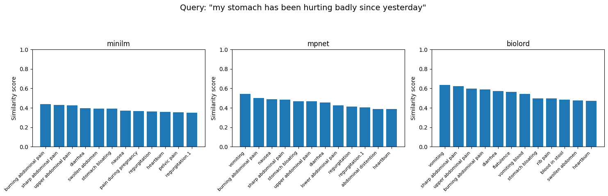
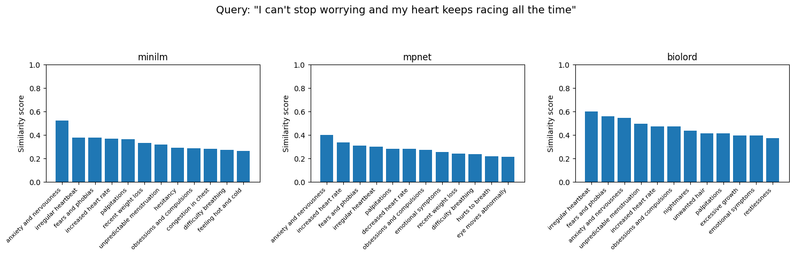

# **Symptom Extraction and Disease Mapping System**

### *A backend-first approach to transforming doctor–patient conversations into structured diagnostic insights.*

---

## **Overview**

This project explores the idea of supporting clinical diagnosis by converting natural doctor–patient conversations into structured symptom sets and mapping them to probable diseases.
The long-term goal is to generate a visual diagnostic reasoning graph that helps doctors quickly assess how combinations of symptoms relate to specific diseases.

This repository contains the backend foundation required to:

* Extract symptoms from unstructured conversations
* Normalize those symptoms into a medically structured vocabulary
* Match them against a large dataset of diseases
* Produce a ranked list of possible conditions

---

## **Motivation**

Natural human conversations rarely use precise medical terminology.
Patients say things like *“my stomach feels weird”* rather than *“upper abdominal discomfort.”*
However, medical datasets encode symptoms in highly technical language.

To bridge this gap, the system must:

1. **Understand natural language symptom descriptions**
2. **Map them to canonical medical symptom names**
3. **Infer which symptoms are actually present (and which are negated)**
4. **Determine diseases associated with those symptoms**

This project focuses on building that translation layer end-to-end.

---

## **Dataset**

The system uses a Kaggle dataset containing:

* ~250,000 records
* 377 unique symptoms (each represented as a binary column)
* A wide range of diseases, each mapped to one or more symptoms

The dataset is structured in a “multi-hot” encoding format, where each disease has 0/1 values across 377 symptom columns.

---

## **Key Challenges**

### **1. Natural Language vs. Clinical Terminology**

The dataset symptoms are highly clinical.
Real conversations are not.
This mismatch makes direct keyword matching impossible.

### **2. Synonym and Expression Variability**

Patients describe the same symptom in countless ways.
For accurate retrieval, each clinical symptom needs a broader semantic footprint.

### **3. High Recall vs. High Precision**

Vector retrieval may capture everything remotely related to the symptom, including negations or irrelevant mentions.
A second layer of filtering is required.

### **4. Disease Prediction Based on Partial Symptom Sets**

Most conversations provide incomplete information, so the ranking mechanism must work with sparse symptom clusters.

---

## **System Architecture**

### **1. Symptom Description & Synonym Generation**

All 377 symptom names from the dataset were expanded into:

* A natural-language description
* A list of everyday synonyms and variations of expression

This was generated using a local LLM (Gemma 3, 1B) to produce a structured metadata table.

This enriched metadata acts as the backbone for semantic search.

---

### **2. Vectorization & Embedding Model Evaluation**

The generated symptom metadata was embedded using multiple embedding models:

* MiniLM L6 v2
* MPNet
* BioLord (trained on biomedical text)

Each model was tested for retrieval quality on conversational queries.

**Findings:**

* **MiniLM consistently performed best** for everyday conversational phrasing.
* MPNet was close but slightly less stable.
* BioLord underperformed because it is optimized for medical-to-medical language, not casual speech.

MiniLM was selected as the primary embedding model for the system.

---

### **3. Symptom Retrieval from Conversations**

Doctor and patient dialogues were passed through the vector index.
Each utterance returned a list of the most semantically aligned symptom candidates.

Due to conversational looseness, each sample conversation produced **40–60 initial symptoms**.
This step intentionally focuses on high recall.

---

<table border="1" class="dataframe">
  <thead>
    <tr style="text-align: right;">
      <th></th>
      <th>turn_idx</th>
      <th>speaker</th>
      <th>message</th>
      <th>top_symptoms</th>
      <th>scores</th>
    </tr>
  </thead>
  <tbody>
    <tr>
      <th>0</th>
      <td>0</td>
      <td>Doctor</td>
      <td>Good morning. How are you feeling today?</td>
      <td>["feeling ill", "sleepiness", "increased heart rate", "f...</td>
      <td>[0.4250568151473999, 0.3665846586227417, 0.3317884504795...</td>
    </tr>
    <tr>
      <th>1</th>
      <td>1</td>
      <td>Patient</td>
      <td>Good morning, doctor. I've been feeling a bit off lately...</td>
      <td>["feeling ill", "sleepiness", "fatigue", "recent weight ...</td>
      <td>[0.4727005064487457, 0.40603166818618774, 0.403365999460...</td>
    </tr>
    <tr>
      <th>2</th>
      <td>2</td>
      <td>Doctor</td>
      <td>I see. Can you tell me more about what you’ve been exper...</td>
      <td>["mass or swelling around the anus", "cloudy eye", "anxi...</td>
      <td>[0.42108649015426636, 0.4167355000972748, 0.396097242832...</td>
    </tr>
    <tr>
      <th>3</th>
      <td>3</td>
      <td>Patient</td>
      <td>Well, I feel tired all the time, even after sleeping wel...</td>
      <td>["sleepiness", "fatigue", "insomnia", "eye strain", "hea...</td>
      <td>[0.5923658609390259, 0.5198987722396851, 0.4426339268684...</td>
    </tr>
    <tr>
      <th>4</th>
      <td>4</td>
      <td>Doctor</td>
      <td>How long have you been feeling this way?</td>
      <td>["recent weight loss", "feeling ill", "anxiety and nervo...</td>
      <td>[0.39236921072006226, 0.3876936435699463, 0.358343303203...</td>
    </tr>
    <tr>
      <th>5</th>
      <td>5</td>
      <td>Patient</td>
      <td>It's been going on for about a week now.</td>
      <td>["change in skin mole size or color", "leg lump or mass"...</td>
      <td>[0.2886980175971985, 0.27980947494506836, 0.263299822807...</td>
    </tr>
    <tr>
      <th>6</th>
      <td>6</td>
      <td>Doctor</td>
      <td>Any other symptoms, like trouble sleeping or changes in ...</td>
      <td>["difficulty eating", "decreased appetite", "recent weig...</td>
      <td>[0.5243058204650879, 0.5154721140861511, 0.4641127586364...</td>
    </tr>
    <tr>
      <th>7</th>
      <td>7</td>
      <td>Patient</td>
      <td>Actually, yes. I've had trouble falling asleep and I’m n...</td>
      <td>["decreased appetite", "difficulty eating", "sleepiness"...</td>
      <td>[0.4460548162460327, 0.392599493265152, 0.37761747837066...</td>
    </tr>
    <tr>
      <th>8</th>
      <td>8</td>
      <td>Doctor</td>
      <td>Okay, and have you noticed anything that makes you feel ...</td>
      <td>["feeling ill", "swollen lymph nodes", "cloudy eye", "de...</td>
      <td>[0.39185547828674316, 0.36103785037994385, 0.35254785418...</td>
    </tr>
    <tr>
      <th>9</th>
      <td>9</td>
      <td>Patient</td>
      <td>Not really. Rest helps a little, but the tiredness comes...</td>
      <td>["fatigue", "sleepiness", "insomnia", "restlessness", "w...</td>
      <td>[0.5026041865348816, 0.4588342010974884, 0.3659862875938...</td>
    </tr>
    <tr>
      <th>10</th>
      <td>10</td>
      <td>Doctor</td>
      <td>Have you been under a lot of stress recently?</td>
      <td>["anxiety and nervousness", "fears and phobias", "distur...</td>
      <td>[0.3669467270374298, 0.34229326248168945, 0.335086643695...</td>
    </tr>
    <tr>
      <th>11</th>
      <td>11</td>
      <td>Patient</td>
      <td>Yes, work has been pretty hectic and I’ve been worried a...</td>
      <td>["hesitancy", "lack of growth", "sleepiness", "difficult...</td>
      <td>[0.40378034114837646, 0.3097139596939087, 0.303839683532...</td>
    </tr>
    <tr>
      <th>12</th>
      <td>12</td>
      <td>Doctor</td>
      <td>That can definitely affect how you feel. How about your ...</td>
      <td>["emotional symptoms", "anxiety and nervousness", "fears...</td>
      <td>[0.48558831214904785, 0.4834930896759033, 0.430465817451...</td>
    </tr>
    <tr>
      <th>13</th>
      <td>13</td>
      <td>Patient</td>
      <td>Sometimes I feel anxious, and a bit down, but nothing to...</td>
      <td>["anxiety and nervousness", "fears and phobias", "hesita...</td>
      <td>[0.6150950193405151, 0.5381858348846436, 0.4780496954917...</td>
    </tr>
    <tr>
      <th>14</th>
      <td>14</td>
      <td>Doctor</td>
      <td>Thank you for sharing that. It’s good to talk about it. ...</td>
      <td>["mass or swelling around the anus", "mass in scrotum", ...</td>
      <td>[0.33630573749542236, 0.32982367277145386, 0.31104564666...</td>
    </tr>
    <tr>
      <th>15</th>
      <td>15</td>
      <td>Patient</td>
      <td>No, that’s about it. Just hoping to feel better soon.</td>
      <td>["feeling ill", "flu-like syndrome", "fatigue", "recent ...</td>
      <td>[0.4345366954803467, 0.3180099129676819, 0.3125025331974...</td>
    </tr>
    <tr>
      <th>16</th>
      <td>16</td>
      <td>Doctor</td>
      <td>I understand. Let’s keep talking about how you’re feelin...</td>
      <td>["recent weight loss", "feeling ill", "sleepiness", "anx...</td>
      <td>[0.46048495173454285, 0.45307496190071106, 0.41271954774...</td>
    </tr>
  </tbody>
</table>

---

<table border="1" class="dataframe">
  <thead>
    <tr style="text-align: right;">
      <th></th>
      <th>candidate_symptom</th>
    </tr>
  </thead>
  <tbody>
    <tr>
      <th>0</th>
      <td>anxiety and nervousness</td>
    </tr>
    <tr>
      <th>1</th>
      <td>change in skin mole size or color</td>
    </tr>
    <tr>
      <th>2</th>
      <td>cloudy eye</td>
    </tr>
    <tr>
      <th>3</th>
      <td>decreased appetite</td>
    </tr>
    <tr>
      <th>4</th>
      <td>delusions or hallucinations</td>
    </tr>
    <tr>
      <th>5</th>
      <td>depression</td>
    </tr>
    <tr>
      <th>6</th>
      <td>depressive or psychotic symptoms</td>
    </tr>
    <tr>
      <th>7</th>
      <td>difficulty breathing</td>
    </tr>
    <tr>
      <th>8</th>
      <td>difficulty eating</td>
    </tr>
    <tr>
      <th>9</th>
      <td>disturbance of memory</td>
    </tr>
    <tr>
      <th>10</th>
      <td>elbow swelling</td>
    </tr>
    <tr>
      <th>11</th>
      <td>emotional symptoms</td>
    </tr>
    <tr>
      <th>12</th>
      <td>excessive appetite</td>
    </tr>
    <tr>
      <th>13</th>
      <td>eye strain</td>
    </tr>
    <tr>
      <th>14</th>
      <td>fatigue</td>
    </tr>
    <tr>
      <th>15</th>
      <td>fears and phobias</td>
    </tr>
    <tr>
      <th>16</th>
      <td>feeling hot</td>
    </tr>
    <tr>
      <th>17</th>
      <td>feeling hot and cold</td>
    </tr>
    <tr>
      <th>18</th>
      <td>feeling ill</td>
    </tr>
    <tr>
      <th>19</th>
      <td>flu-like syndrome</td>
    </tr>
    <tr>
      <th>20</th>
      <td>headache</td>
    </tr>
    <tr>
      <th>21</th>
      <td>hesitancy</td>
    </tr>
    <tr>
      <th>22</th>
      <td>increased heart rate</td>
    </tr>
    <tr>
      <th>23</th>
      <td>insomnia</td>
    </tr>
    <tr>
      <th>24</th>
      <td>kidney mass</td>
    </tr>
    <tr>
      <th>25</th>
      <td>lack of growth</td>
    </tr>
    <tr>
      <th>26</th>
      <td>leg lump or mass</td>
    </tr>
    <tr>
      <th>27</th>
      <td>lump or mass of breast</td>
    </tr>
    <tr>
      <th>28</th>
      <td>mass in scrotum</td>
    </tr>
    <tr>
      <th>29</th>
      <td>mass on vulva</td>
    </tr>
    <tr>
      <th>30</th>
      <td>mass or swelling around the anus</td>
    </tr>
    <tr>
      <th>31</th>
      <td>muscle swelling</td>
    </tr>
    <tr>
      <th>32</th>
      <td>recent weight loss</td>
    </tr>
    <tr>
      <th>33</th>
      <td>restlessness</td>
    </tr>
    <tr>
      <th>34</th>
      <td>scanty menstrual flow</td>
    </tr>
    <tr>
      <th>35</th>
      <td>sleepiness</td>
    </tr>
    <tr>
      <th>36</th>
      <td>swelling of scrotum</td>
    </tr>
    <tr>
      <th>37</th>
      <td>swollen lymph nodes</td>
    </tr>
    <tr>
      <th>38</th>
      <td>weakness</td>
    </tr>
  </tbody>
</table>

<table border="1" class="dataframe">
  <thead>
    <tr style="text-align: right;">
      <th></th>
      <th>diseases</th>
      <th>match_count</th>
      <th>coverage</th>
      <th>disease_symptom_count</th>
      <th>precision_like</th>
      <th>score</th>
    </tr>
  </thead>
  <tbody>
    <tr>
      <th>0</th>
      <td>restless leg syndrome</td>
      <td>4</td>
      <td>0.8</td>
      <td>8</td>
      <td>0.500000</td>
      <td>0.710000</td>
    </tr>
    <tr>
      <th>1</th>
      <td>acute stress reaction</td>
      <td>4</td>
      <td>0.8</td>
      <td>11</td>
      <td>0.363636</td>
      <td>0.669091</td>
    </tr>
    <tr>
      <th>2</th>
      <td>narcolepsy</td>
      <td>3</td>
      <td>0.6</td>
      <td>7</td>
      <td>0.428571</td>
      <td>0.548571</td>
    </tr>
    <tr>
      <th>3</th>
      <td>eating disorder</td>
      <td>3</td>
      <td>0.6</td>
      <td>9</td>
      <td>0.333333</td>
      <td>0.520000</td>
    </tr>
    <tr>
      <th>4</th>
      <td>neurosis</td>
      <td>3</td>
      <td>0.6</td>
      <td>11</td>
      <td>0.272727</td>
      <td>0.501818</td>
    </tr>
    <tr>
      <th>...</th>
      <td>...</td>
      <td>...</td>
      <td>...</td>
      <td>...</td>
      <td>...</td>
      <td>...</td>
    </tr>
    <tr>
      <th>225</th>
      <td>hypoglycemia</td>
      <td>1</td>
      <td>0.2</td>
      <td>12</td>
      <td>0.083333</td>
      <td>0.165000</td>
    </tr>
    <tr>
      <th>226</th>
      <td>marijuana abuse</td>
      <td>1</td>
      <td>0.2</td>
      <td>12</td>
      <td>0.083333</td>
      <td>0.165000</td>
    </tr>
    <tr>
      <th>227</th>
      <td>nose disorder</td>
      <td>1</td>
      <td>0.2</td>
      <td>12</td>
      <td>0.083333</td>
      <td>0.165000</td>
    </tr>
    <tr>
      <th>228</th>
      <td>spinal stenosis</td>
      <td>1</td>
      <td>0.2</td>
      <td>12</td>
      <td>0.083333</td>
      <td>0.165000</td>
    </tr>
    <tr>
      <th>229</th>
      <td>sprain or strain</td>
      <td>1</td>
      <td>0.2</td>
      <td>12</td>
      <td>0.083333</td>
      <td>0.165000</td>
    </tr>
  </tbody>
</table>

230 rows × 6 columns

---

### **4. LLM-Based Filtering (High Precision Layer)**

Because conversations include negations, clarifications, and hypothetical statements, the retrieved symptom list was filtered using an LLM.
This filtering step determines:

* Which symptoms are actually present
* Which ones were mentioned but explicitly denied
* Which ones do not apply to the patient

This results in a cleaned, validated symptom list.

---

### **5. Disease Ranking**

With a validated symptom set, the system:

1. Compares them against every disease in the dataset
2. Calculates how many symptoms overlap
3. Computes a relevance score
4. Produces a top-ranked list of disease candidates

This ranking gives the backend foundation for generating a visual diagnostic map in the future.

---

## **Current Capabilities**

* Extracts symptom candidates from raw conversation text
* Normalizes and validates symptoms using LLM reasoning
* Ranks diseases based on symptom overlap
* Provides structured outputs ready for front-end visualization
* Handles natural, messy conversations without relying on exact keyword matches

---

## **Planned Features**

* A visual graph mapping symptoms → diseases
* Explanation nodes: why the model made certain inferences
* Multi-turn conversational tracking
* Integration with real doctor–patient transcripts
* Medical summarization and “clinical note” generation
* Support for multilingual symptom extraction

---

## **Why This Project Matters**

Most diagnostic decision support tools rely on structured inputs.
But real clinical reasoning begins with natural conversation.

By enabling reliable extraction and mapping of symptoms from unstructured dialogue, this project moves toward:

* Smarter clinical assistants
* Automated medical note generation
* Rural telemedicine support
* Training tools for medical students
* More interpretable diagnostic systems

This backend lays the groundwork for the next generation of clinical reasoning interfaces.

---

## **Status**

This repository represents the core backend logic.
The conversational interface and visual diagnostic graph will be developed in future iterations.

